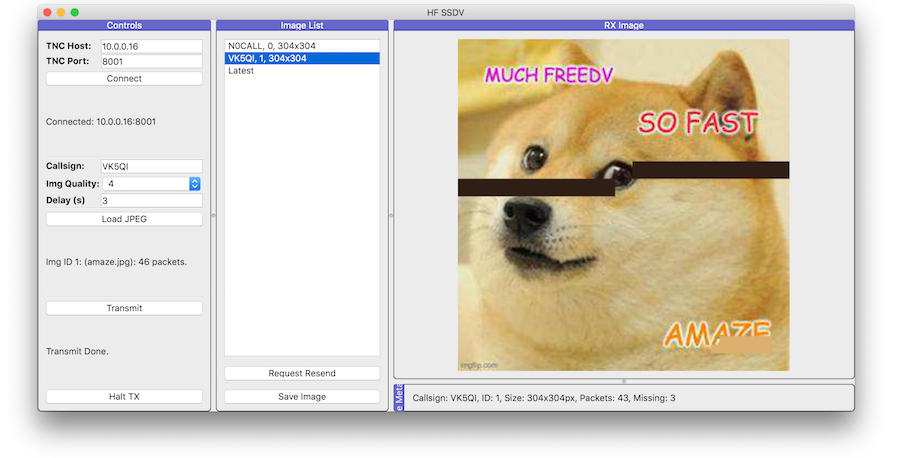

# HF Slow-Scan Digital Video

Send Slow-Scan Digital Video (images) over HF via a KISS TNC!

This code was written to make use of [xssfox's freedv-tnc](https://github.com/xssfox/freedv-tnc) application, which makes uses of the FreeDV OFDM modem to transmit data over a HF channel. It may work over other KISS TNCs that present a TCP interface, but this has not been tested.

** Warning: This is all pretty hacky, and needs a lot of cleanup. Also features are still in the process of being implemented. **

Written by Mark Jessop <vk5qi@rfhead.net>



### TODO List
* Implement Resend of missing packets.
* Switch between received images in GUI.
* Refactor and cleanup.


## Usage

### Dependencies
* You will need freedv-tnc running, and presenting as a TCP server (e.g. use the `--tcp` option).
* You will need to build [ssdv](https://github.com/fsphil/ssdv/), and copy the `ssdv` binary into this directory.

### Create a Virtual Environment

Create a virtual environment and install dependencies.

```console
$ python3 -m venv venv
$ source venv/bin/activate
(venv) $ pip install pip -U       (Optional - this updates pip)
(venv) $ pip install -r requirements.txt
```

### Install Package

Install package in a editable state. This type of installation allows a
developer to make changes to the source code while retaining the installation
entry points so it can be used like a normal install.

```console
(venv) $ pip install -e .
```

### Run
`$ python -m hfssdv.gui`